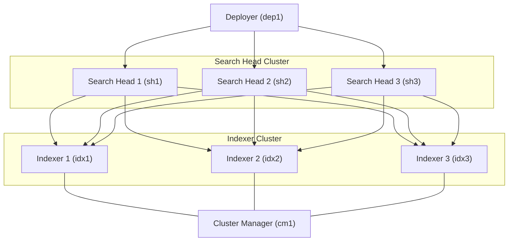

# Splunk Indexer Cluster Lab (Docker)

## Overview

This repository provides a Docker-based Splunk environment designed to simulate a distributed deployment.

It includes the following components:

- Indexer Cluster
- Search Head Cluster (SHC)
- Search Head Deployer
- Cluster Manager

The Search Head Cluster is preconfigured and connected to the Indexer Cluster as search peers.

This lab enables hands-on practice with:

- Building and configuring an Indexer Cluster
- Connecting Search Heads to Indexers
- Managing Search Head Clusters
- Deploying apps using a Deployer
- Understanding distributed search architecture

---

## Architecture


---
## Components
 Component | Hostname | Web Port | Management Port | Indexing Port |
|-----------|----------|----------|----------------|--------------|
| Cluster Manager | cm1 | 8000 | 8089 | N/A |
| Indexer 1 | idx1 | 8000 | 8089 | 9997 |
| Indexer 2 | idx2 | 8000 | 8089 | 9997 |
| Indexer 3 | idx3 | 8000 | 8089 | 9997 |
| Search Head 1 | sh1 | 8000 | 8089 | N/A |
| Search Head 2 | sh2 | 8000 | 8089 | N/A |
| Search Head 3 | sh3 | 8000 | 8089 | N/A |
| Deployer | dep1 | 8000 | 8089 | N/A |

All containers run on the external Docker network:

```
skynet
```

---

## Prerequisites

### 1 Install Docker

Install Docker and Docker Compose.

```
https://docs.docker.com/get-docker/
```

---

### 2 Create Docker Network

Create the external network used by the lab.

```
docker network create skynet
```

---

### 3 Create `.env` File

Create a `.env` file in the project root.

Example:

```
SPLUNK_PASSWORD=YourStrongPassword
SPLUNK_IDXC_SECRET=ClusterSecret123
SPLUNK_SHC_SECRET=SHClusterSecret123
```

---

## Deployment Modes

### 1 Base Environment (Manual Configuration)

Starts all components without configuring the Indexer Cluster.

The Search Head Cluster is already configured.

Use this mode to practice:

Initializing the Indexer Cluster
Registering peer nodes
Configuring replication and search factors
Connecting Search Heads to Indexers

Start:

```
docker-compose -f docker-compose.manual.yml up -d
```

---

### 2 Preconfigured Indexer Cluster

Automatically configures the Indexer Cluster during startup:

Sets cm1 as Cluster Manager
Joins all indexers to the cluster
Connects Search Heads as search peers

Start:

```
docker-compose -f docker-compose.preconfigured.yml up -d
```

The environment is ready for distributed search.

## Repository Structure

```
.
├── .env
├── docker-compose.manual.yml
├── docker-compose.preconfigured.yml
├── README.md
├── docs/
│   ├── deployment-guide.md
│   ├── post-deployment-validation.md
```
