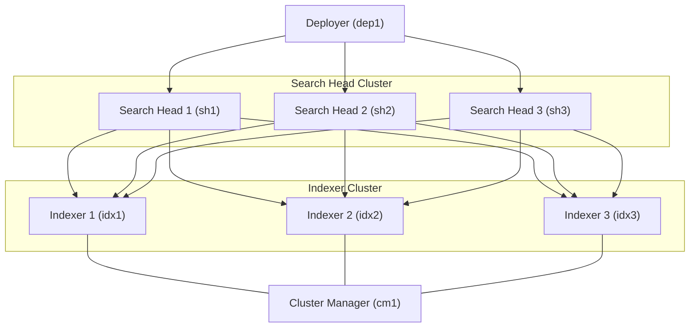

# Splunk Indexer Cluster Lab (Docker)

## Overview

This repository provides a **Docker-based Splunk clustered environment** designed to simulate a distributed Splunk deployment.

The lab demonstrates the following Splunk architectures:

- **Indexer Clustering**
- **Search Head Clustering (SHC)**
- **Search Head Deployer**

In this lab:

- The **Search Head Cluster is already configured** in both deployment modes.
- The **Search Heads act as search peers to the Indexer Cluster**.
- The **difference between the two deployment modes only affects the Indexer Cluster configuration**.

This environment allows you to practice:

- Building an Indexer Cluster
- Connecting Search Heads to Indexer peers
- Managing Search Head Clusters
- Using a Deployer to manage Search Head apps
- Understanding distributed search architecture

---

## Architecture


---

 Component | Hostname | Web Port | Management Port | Indexing Port |
|-----------|----------|----------|----------------|--------------|
| Cluster Manager | cm1 | 8000 | 8089 | N/A |
| Indexer 1 | idx1 | 8000 | 8089 | 9997 |
| Indexer 2 | idx2 | 8000 | 8089 | 9997 |
| Indexer 3 | idx3 | 8000 | 8089 | 9997 |
| Search Head 1 | sh1 | 8000 | 8089 | N/A |
| Search Head 2 | sh2 | 8000 | 8089 | N/A |
| Search Head 3 | sh3 | 8000 | 8089 | N/A |
| Deployer | dep1 | 8000 | 8089 | N/A |

All containers run on the external Docker network:

```
skynet
```

---

## Prerequisites

### 1 Install Docker

Install Docker and Docker Compose.

```
https://docs.docker.com/get-docker/
```

---

### 2 Create Docker Network

Create the external network used by the lab.

```
docker network create skynet
```

---

### 3 Create `.env` File

Create a `.env` file in the project root.

Example:

```
SPLUNK_PASSWORD=YourStrongPassword
SPLUNK_IDXC_SECRET=ClusterSecret123
SPLUNK_SHC_SECRET=SHClusterSecret123
```

---

## Deployment Modes

### 1 Base Environment

This deployment starts all Splunk components.

The **Search Head Cluster is already configured**, but the **Indexer Cluster is not yet configured**.

Components started:

- Cluster Manager
- 3 Indexers
- Search Head Cluster (3 members)
- Deployer

This mode allows you to manually practice:

- Indexer cluster configuration
- Peer node registration
- Setting replication factor and search factor
- Connecting the indexers to the Cluster Manager

---

### 2 Preconfigured Indexer Cluster

This deployment automatically configures the Indexer Cluster during container startup.

Automatic configuration includes:

- Setting **cm1 as Cluster Manager**
- Joining **idx1, idx2, idx3** to the Indexer Cluster
- Connecting the Search Head Cluster to the indexers as **search peers**

The Search Head Cluster is already configured and ready to perform distributed searches across the indexer cluster.
